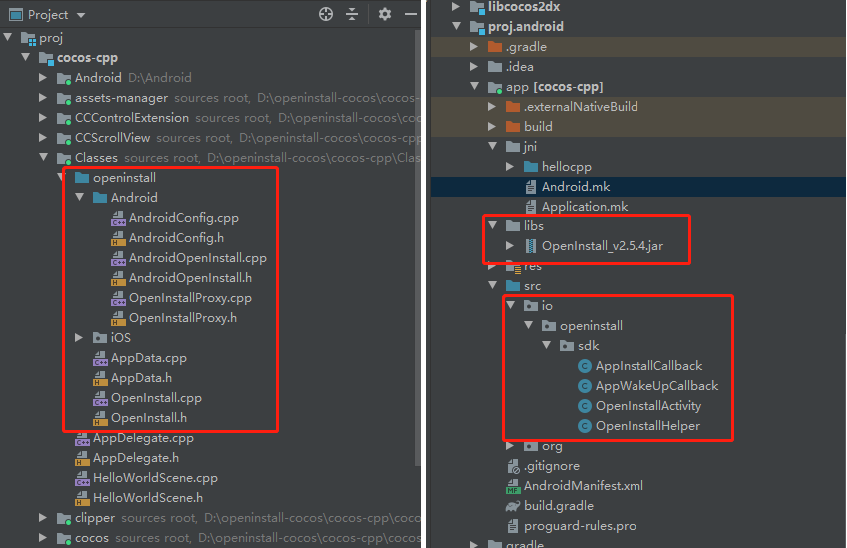

# Android 集成指南

**2.5.3 以下版本用户升级请注意，针对广告平台集成，增删了一些接口，请认真查看文档进行升级**

## 拷贝文件

- 将 `Classes/openinstall` 文件夹拷贝到项目的 `Classes` 目录下
- 将 `Android` 目录下的 `src` 文件夹下的内容拷贝到项目的 `app/src` 目录下
- 将 `Android` 目录下的 `libs`文件夹下的jar文件拷贝到项目的 `app/libs` 目录下 

> 注意：请开发者在进行升级时，重新拷贝并覆盖旧的文件，删除低版本SDK  
  
最终文件目录结构如下：  


## 配置项目

### 添加 C++ 源文件定义

添加 openinstall 相关的 C++ 文件到 `Android.mk` 的 `LOCAL_SRC_FILES` 中

```
        ../../../Classes/openinstall/OpenInstall.cpp \
        ../../../Classes/openinstall/AppData.cpp \
        ../../../Classes/openinstall/Android/AndroidConfig.cpp \
        ../../../Classes/openinstall/Android/OpenInstallProxy.cpp \
        ../../../Classes/openinstall/Android/AndroidOpenInstall.cpp
```

> 注意：请开发者在进行升级时，检查是否有新添加的 C++ 文件

示例如下：  


### 添加应用权限

在 `AndroidManifest.xml` 中添加 `openinstall` 需要的权限

``` xml
<uses-permission android:name="android.permission.INTERNET"/>
<uses-permission android:name="android.permission.ACCESS_NETWORK_STATE"/>
```

### 配置 AppKey 和 scheme
前往 [openinstall控制台] (https://developer.openinstall.io/) ，进入应用，选择 “Android集成”，切换到“Android应用配置”，获取应用的 AppKey 和 scheme。  


#### AppKey 配置
在 `AndroidManifest.xml` 的 `application` 标签中添加

``` xml
    <meta-data
        android:name="com.openinstall.APP_KEY"
        android:value="OPENINSTALL_APPKEY"/>
```
#### scheme 配置
- 将启动 `AppActivity` 替换成 openinstall 提供的 `OpenInstallActivity`
- 给启动 `Activity` 添加 `android:launchMode="singleTask"` 属性
- 给启动 `Activity` 添加 `scheme` 配置

最终配置大致如下
``` xml
    <activity
        android:name="io.openinstall.sdk.OpenInstallActivity"
        android:configChanges="orientation|keyboardHidden|screenSize"
        android:label="@string/app_name"
        android:launchMode="singleTask"
        android:screenOrientation="landscape"
        android:theme="@android:style/Theme.NoTitleBar.Fullscreen">

        <intent-filter>
            <action android:name="android.intent.action.MAIN"/>
            <category android:name="android.intent.category.LAUNCHER"/>
        </intent-filter>

        <intent-filter>
            <action android:name="android.intent.action.VIEW"/>

            <category android:name="android.intent.category.DEFAULT"/>
            <category android:name="android.intent.category.BROWSABLE"/>

            <data android:scheme="OPENINSTALL_SCHEME"/>
        </intent-filter>

    </activity>
```
> 如果有其他的逻辑需要加入 `AppActivity` 中，可以采用继承 `OpenInstallActivity` 来实现

#### 广告平台接入
1、针对广告平台接入，新增配置接口，在调用 `init` 之前调用。参考 [广告平台对接Android集成指引](https://www.openinstall.io/doc/ad_android.html)
``` cpp
    openInstall2dx::AndroidConfig adConfig = openInstall2dx::AndroidConfig();
    // SDK 需要获取广告追踪相关参数
    adConfig.setAdEnabled(true);
    // SDK 使用传入的oaid，不再获取oaid
    adConfig.setOaid("通过移动安全联盟获取到的 oaid");
    // SDK 使用传入的gaid，不再获取gaid
    adConfig.setGaid("通过 google api 获取到的 advertisingId");
    // 禁止 SDK 获取 imei
    adConfig.setImeiDisabled(true);
    // 禁止 SDK 获取 mac 地址
    adConfig.setMacDisabled(true);
    openInstall2dx::OpenInstall::configAndroid(adConfig);
```
> 注意：`OpenInstall::config(adEnabled, oaid, gaid)` 接口已移除，请使用新的配置接口  

2、为了精准地匹配到渠道，需要获取设备唯一标识码（IMEI），因此需要在 AndroidManifest.xml 中添加权限声明 
```
<uses-permission android:name="android.permission.READ_PHONE_STATE"/>
```
3、在权限申请成功后，再进行openinstall初始化。**无论终端用户是否同意，都要调用初始化**
> 注意：`OpenInstall::init(permission)` 接口已移除，请自行处理权限请求
